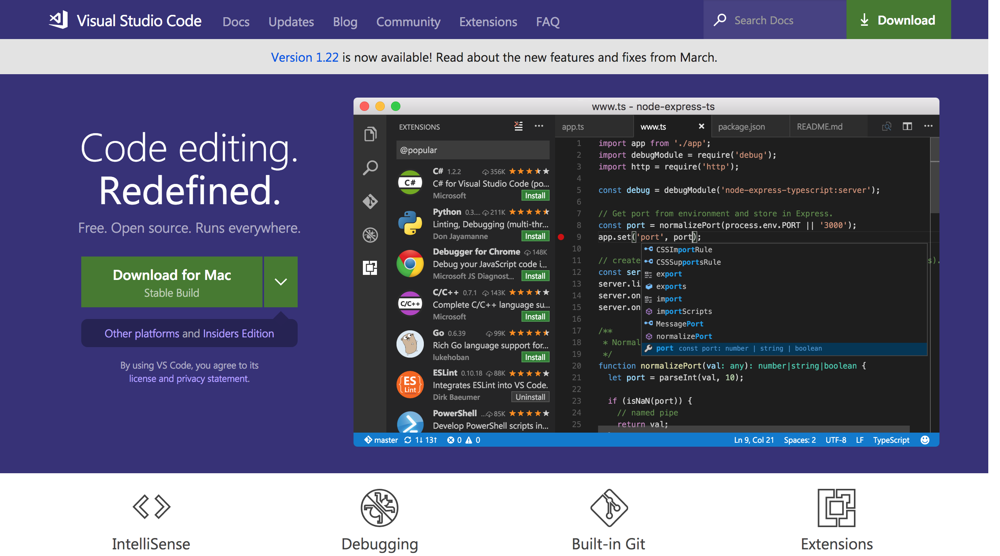

# Editor

Before you begin your coding adventure, it's a good idea to download a text editor suitable for programming. There are numerous editors available online each with their own pros and cons, but we recommend to use **Visual Studio Code**.

## Visual Studio Code

  

Visual Studio Code (or VS Code) is an open source code editor developed by Microsoft for Windows, Linux and macOS. In the [Stack Overflow 2018 Developer Survey](https://insights.stackoverflow.com/survey/2018/), VS Code was ranked the most popular developer environment tool, with 34.9% of 75398 respondents claiming to use it.

### Installing Visual Studio Code

  

#### macOS

* Head to [Visual Studio Code's website](https://code.visualstudio.com/) and hit "_Download for Mac_" button.
* Follow the instructions on the installer.
* You should now be able to use Visual Studio Code.

#### Other systems

Other systems' installing process may be different. Please make a **Pull Request** to this documentation explaining the process for your platform of choice.
