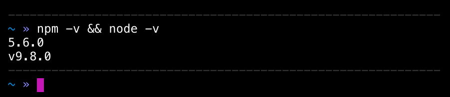

# Essentials

## Node.js and npm

Node.js is a javascript runtime engine. It's most commonly used in backend solutions using javascript, but has been gaining traction as sort of a build and automating tool in frontend side as well. Most of the projects being worked on at Digitalents are made in javascript (or WordPress – more on that later).

npm or (Node Package Manager) is – as the name suggests – a package manager for Node.js. Package manager is a collection of tools helping you to install, upgrade, configure and remove programs or modules. With npm, you can for example install node modules globally, or as a project dependencies.

### Installing Node.js and npm

#### macOS

* Head over to [Node's website](https://nodejs.org/en/)
* Click the download button with "_Recommended for Most Users_" text below the version number.
* Follow the installer instructions.
* To make sure both are installed, open up terminal and run `node -v && npm -v` `-v` stands for _version_. This argument will print out the version number for both programs respectively. You should see something like this on your terminal: 
* That's it! You now have both node.js and npm installed on your system.

::: tip Other Systems
Other systems' installing process may be different. Please make a **Pull Request** to this documentation explaining the process for your platform of choice.
:::

## Version Control


As [Wikipedia puts it](https://en.wikipedia.org/wiki/Version_control), Version Control refers to the management of changes to documents, computer programs, large web sites, and other collections of information.

### What's the Latest Version Again?

Arguably, the most basic form of version control to not-so-tech-savy people is locally renaming different versions of the same source file to something like `my-app-2018-04-22.js`. However as easy and comfortable this can seem at first, managing different versions of files this way can become an unmanageable mess as your project grows.

Your project directory might grow from this;

```
  my-app/
    | app.js
    | account/
    |   | accountManager.js
    | routes/
    |   | index.js
    |   | accountPage.js
    |   | login.js
    | server.js
```

To this;

```
  my-app/
    | _app.js
    | app.js
    | account/
    |   | accountManager.js.backup
    |   | accountManager.js
    | routes/
    |   | newIndex.js
    |   | oldIndex.js
    |   | accountPage.js
    |   | neoAccountPage.js
    |   | login.js
    | server.js
    | app-bundle1.zip
    | app.bundle11111111.zip
    | app.bundle2.zip
    | app.bundle-final.zip
    | app-bundle-final-final.zip
```

This is obviously what we don't want to happen, especially when working in a team.

### Git to the Rescue!

[Git](https://git-scm.com/) is a free, open source distributed version control system for small-to-large projects. Git itself refers it to be fast, performant and easy to learn, but most importantly is arguably the most used version control system in teams handling source code. Oh, and it's made by Linus Torvalds!

Git allows groups of people to work on the same code at the same time without stepping on each other's toes constantly.

### Git ain't Easy

Contradicting a bit Git's statement on being easy to learn, it is quite difficult to master. In fact, if someone comes up to you and says they "know git 100%", politely proceed to slap them on the cheek and tell 'em they're lying.

<p align="middle" style="margin: 2em 0px;">
  
</p>

Thankfully, there's only handful of git commands you need to learn to make most out of the system. Here's a couple in a nutshell;

---

#### `git init`

Initializes a git repository in the active folder.

#### `git status`

Prints out the current state of the project.

#### `git add filename.txt`

Starts tracking the specified file(s).

#### `git commit -m "added some text file"`

"Commits" the tracked (a.k.a. staged) files to the git repository with a message describing the changes (`-m` stands for message).

#### `git remote add origin https://github.com/organization/my-repository.git`

Adds a remote repository link with the specified origin.

#### `git push -u origin master`

Pushes the local git repository to specified remote location (e.g. github). Specifically to the master branch.

#### `git pull origin master`

Checks for changes on the remote repository and pulls down any new changes to the local repository.

---

### Learning Git

Don't worry if all of this goes over your head right now. The best practice right now is for you to start experimenting with git on your personal projects. Learn by doing! Google stuff! Same as with programming in general.

In the meantime you can [take this interactive tutorial by GitHub](https://try.github.io/) to familiarize yourself with various git commands.

::: tip Are You a Git Pro?
Know more useful git learning material? Make a pull request! We'd especially appreciate further expanding the differences between git and services like GitHub and GitLab.
:::
