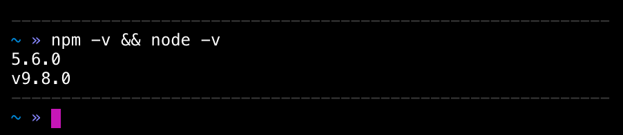

# Node.js and npm

Node.js is a javascript runtime engine. It's most commonly used in backend solutions using javascript, but has been gaining traction as sort of a build and automating tool in frontend side as well. Most of the projects being worked on at Digitalents are made in javascript (or WordPress – more on that later).

npm or (Node Package Manager) is – as the name suggests – a package manager for Node.js. Package manager is a collection of tools helping you to install, upgrade, configure and remove programs or modules. With npm, you can for example install node modules globally, or as a project dependencies.

## Installing Node.js and npm

### macOS

* Head over to [Node's website](https://nodejs.org/en/)
* Click the download button with "_Recommended for Most Users_" text below the version number.
* Follow the installer instructions.
* To make sure both are installed, open up terminal and run `node -v && npm -v` `-v` stands for _version_. This argument will print out the version number for both programs respectively. You should see something like this on your terminal: 
* That's it! You now have both node.js and npm installed on your system.

::: tip Other Systems
Other systems' installing process may be different. Please make a **Pull Request** to this documentation explaining the process for your platform of choice.
:::
